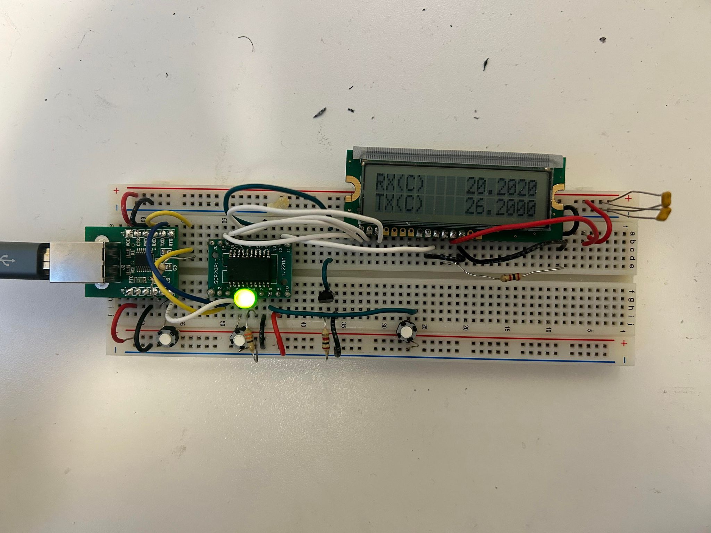
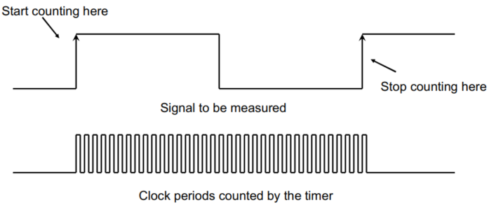
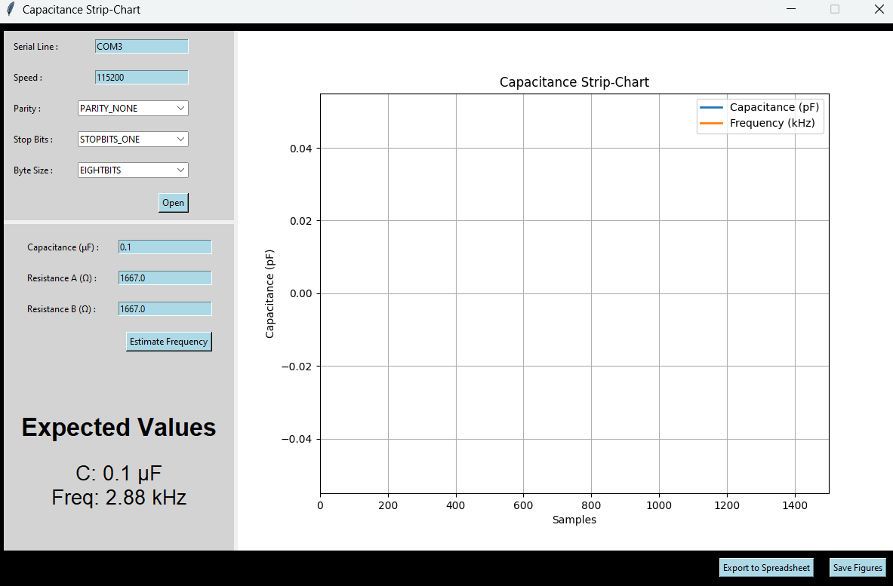

# Capacitance and Resistance Meter

## Contents

* [Overview](#Overview)
* [Firmware](#Firmware)
    * [Capacitance Meter](#Capacitance-Meter)
    * [Resistance Meter](#Resistance-Meter)
* [Versions](#Versions)
* [Tkinter App](#Tkinter-App)
* [Credit](#Credit)
    * [Policy](#Policy)

## Overview

We implemented a simplified version of the **555 Timer** to measure capacitance on an **EFM8LB81** (**8051** family) microcontroller, followed by an improved version on the **STM32** (**ARM Cortex M0** family) microcontroller. We also built a resistance meter in parallel to the main circuit.

    

 

We have attached here the circuit of interest for **V1** of this meter using the **EFM8** microcontroller.

## Firmware

The firmware was developed in the <b>C</b> programming language. We are using a [`Makefile`](EFM8/Firmware/main.mk) to compile [`main.c`](EFM8/Firmware/main.c) and flash the program onto the respective microcontroller.

### Capacitance Meter

We are using the **555 Timer** circuit in its astable mode to generate a square wave. We measure the number of clock cycles for an entire wavelength and use this to calculate the period of the generated signal.

    

 

We use the formula with the designed $R_A = R_B = 1.5 \, \text{k} \Omega$ resistances to calculate the capacitance seen by the meter.

$$ f = \frac{1}{T} = \frac{1.44}{(R_A + 2R_B)C} $$

### Resistance Meter

We are using a voltage divider comprised of a known $R_{REF} = 98.62 \, \text{k} \Omega$ and an unknown resistance. We measure the input pin voltage with an **ADC** to determine the current and resistance.

$$  R = \frac{V_{Pin}}{I}, \,\,\text{where}\,\, I = \frac{V_{SS} - V_{Pin}}{R_{REF}} $$

## Versions

**V1** was built using the **EFM8LB81** microcontroller, whereas **V2** of this meter was built using the **STM32** microcontroller. In this improved version, we have the ability to switch between capacitances with hardware pushbuttons.

The firmware source code was adapted for the **ARM Cortex M0** family. The timers, **ADC**, **LCD** initialization and functions were modified for this in [`main.c`](STM32/Firmware/main.c)

## Tkinter App

We developed a **Python** application with a **Tkinter** user interface to display the incoming data stream of the **555 Timer** frequency (*Note that* $f = \frac{1}{T}$.)

    

 

This app also has an embedded calculator with the actual capacitance and resistances used in the Capacitance Meter. We used this to display the expected values and validate it with the incoming data. Test data was saved to `.csv` files in the [`Logbook`](App/Logbook) directory.

### Demonstration

We have uploaded our Final Demo on <a href="https://youtu.be/13Ug4NJ9nF0?si=DzX3gzpOJep0oHjI" target="_blank">Youtube</a> and have embedded a low resolution compressed version below.

## Credit

This was completed as part of the <b>ELEC 291 - Design Studio</b> project course in the <b>The University of British Columbia Electrical and Computer Engineering</b> undergraduate program. We received tremendous support and guidance from Dr. Jesus Calvino-Fraga.

### Policy

We have read and understood the plagiarism policies at <a href = "https://ece.ubc.ca/graduate/policies-and-procedures/student-responsibilitiesdeclaration/">https://ece.ubc.ca/graduate/policies-and-procedures/student-responsibilitiesdeclaration/</a> and we understand that no excuse for plagiarism will be accepted.